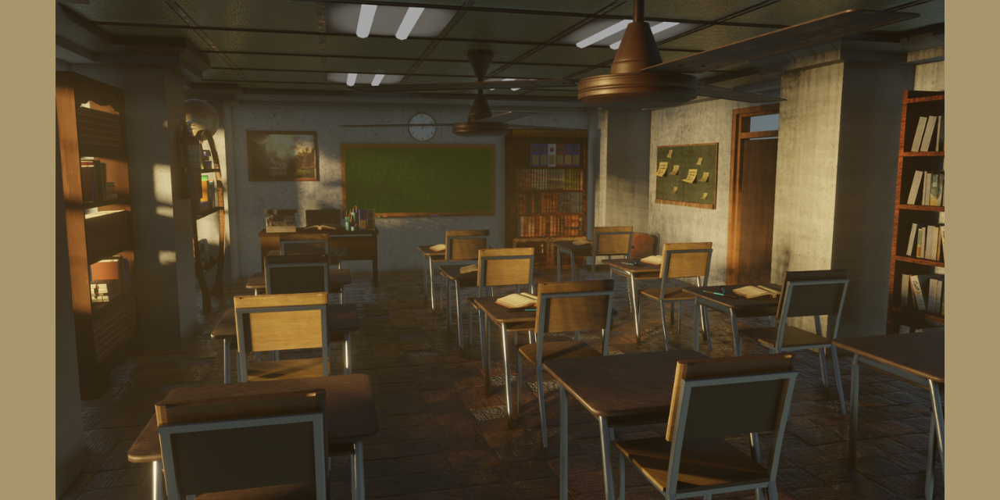

# 3D Classroom Scene using Blender 3D
This is a final project of the 3D Computer Graphics and Animation course. In this project, I created a 3D classroom scene for a survival game using Blender 3D. For the detail on how to make it you may download and read my report that I have already attached within this repository.

